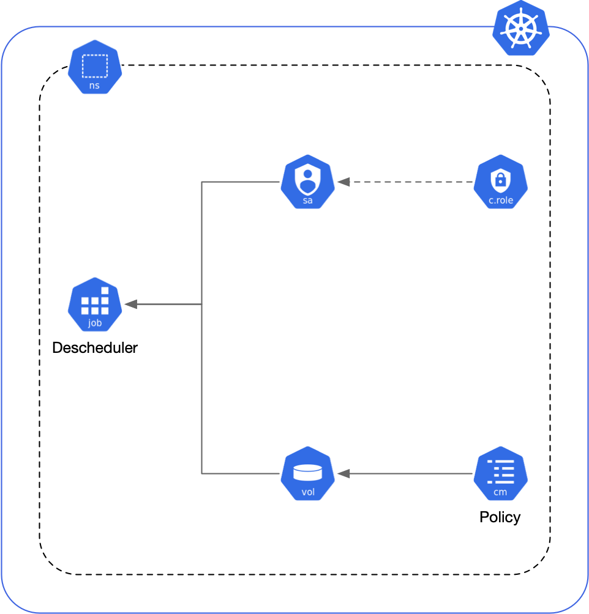

# Terraform-Kubernetes-Descheduler

Install [Descheduler](https://github.com/kubernetes-sigs/descheduler) on Kubernetes with a Terraform Module

## Inputs

| Name                                            | Description                                                                                                                                                                                  | Type                                                                                                                                                            | Default       | Required |
| ----------------------------------------------- | -------------------------------------------------------------------------------------------------------------------------------------------------------------------------------------------- | --------------------------------------------------------------------------------------------------------------------------------------------------------------- | ------------- | -------- |
| `cluster_role`                                  | The cluster role to attach to the Descheduler Service Account, only used when a create_cluster_role = false                                                                                  | `string`                                                                                                                                                        | `null`        | no       |
| `create_cluster_role`                           | Create Cluster Role needed for Descheduler                                                                                                                                                   | `bool`                                                                                                                                                          | `true`        | no       |
| `descheduler_image`                             | The Image for the Descheduler                                                                                                                                                                | `string`                                                                                                                                                        | -             | yes      |
| `name`                                          | Name for the Descheduler                                                                                                                                                                     | `string`                                                                                                                                                        | `descheduler` | no       |
| `namespace`                                     | The namespace to which the Descheduler is deployed                                                                                                                                           | `string`                                                                                                                                                        | `kube-system` | no       |
| `low_node_utilization`                          | This strategy finds nodes that are under utilized and evicts pods, if possible, from other nodes in the hope that recreation of evicted pods will be scheduled on these underutilized nodes. | `object({ tresholds = object({ cpu = number, memory = number, pods = number }), targetThresholds = object({ cpu = number, memory = number, pods = number }) })` | `null`        | no       |
| `remove_duplicates`                             | This strategy makes sure that there is only one pod associated with a Replica Set (RS), Replication Controller (RC), Deployment, or Job running on same node.                                | `bool`                                                                                                                                                          | `null`        | no       |
| `remove_pods_violating_inter_pod_anti_affinity` | This strategy makes sure that pods violating interpod anti-affinity are removed from nodes.                                                                                                  | `bool`                                                                                                                                                          | `null`        | no       |
| `remove_pods_violating_node_affinity`           | This strategy makes sure that pods violating node affinity are removed from nodes.                                                                                                           | `list(string)`                                                                                                                                                  | `null`        | no       |

## Outputs

| Name                | Description                                               |
| ------------------- | --------------------------------------------------------- |
| `cluster_role_name` | Name for the cluster role attached to the Service Account |
| `job`               | Metadata for the Descheduler Job                          |
| `policy_config_map` | Metadata for the Policy Config Map                        |
| `service_account`   | Metadata for the Service Account                          |

## Authors

Module managed by Boite Witte

## License

Apache 2 Licensed
